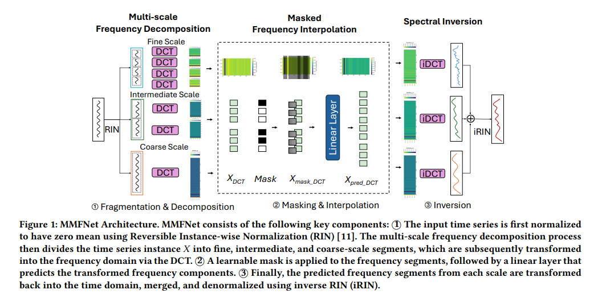
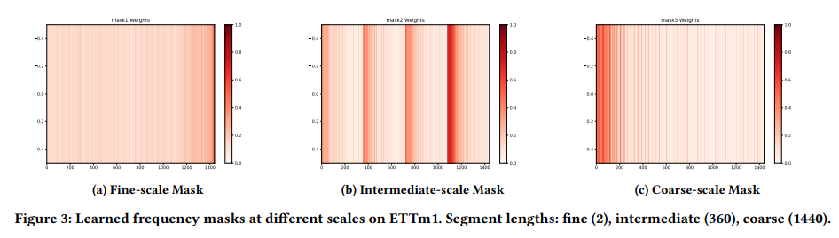
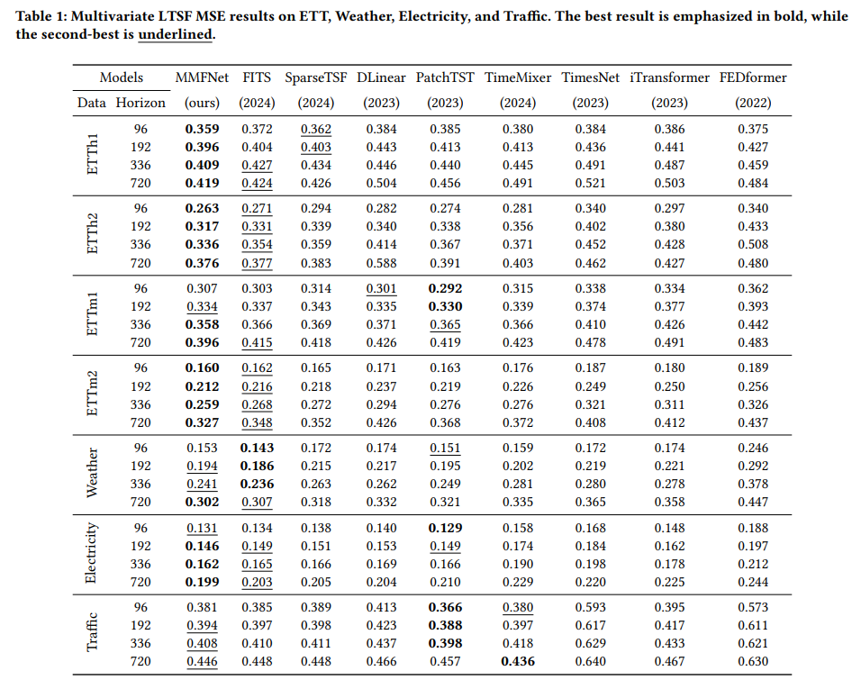

# MMFNet

Welcome to the official repository of the MMFNet paper: "**MMFNet: Multi-Scale Frequency Masking Neural Network for Multivariate Time Series Forecasting**"

## Updates
🚩 **News** (2025.10) MMFNet has been accepted as a paper at **SAC 2026** (The 41st ACM/SIGAPP Symposium on Applied Computing), with a competitive acceptance ratio of **25% (26/104)**.

## 💡 Introduction
MMFNet is a novel, frequency-aware framework for Multivariate Time Series Forecasting (MTSF). At the heart of MMFNet lies the **Multi-Scale Frequency Masking** technique, which enables the model to capture complex temporal patterns by operating across different scales in the frequency domain.

### 1. How it Works: System Architecture
MMFNet follows a structured pipeline to decouple and predict time-series signals:
* **Fragmentation & Decomposition**: The input time series is first normalized to have zero mean using Reversible Instance-wise Normalization (RIN). 
* **Frequency Transformation**: The instance $X$ is divided into fine, intermediate, and coarse-scale segments, which are subsequently transformed into the frequency domain via the **Discrete Cosine Transform (DCT)**.
* **Masking & Interpolation**: A learnable mask is applied to the frequency segments to focus on informative components, followed by a linear layer that predicts the transformed frequency components.
* **Spectral Inversion**: Finally, the predicted frequency segments from each scale are transformed back into the time domain using **inverse DCT (iDCT)**, merged, and denormalized using inverse RIN (iRIN).




### 2. Multi-Scale Frequency Masking
Unlike standard filters, MMFNet learns adaptive masks across different segment lengths to isolate significant periodicities and filter out noise:
* **Fine-scale (Segment length: 2)**: Captures high-frequency fluctuations and rapid local changes.
* **Intermediate-scale (Segment length: 360)**: Identifies mid-range periodicities and seasonal shifts.
* **Coarse-scale (Segment length: 1440)**: Focuses on long-term trends and global structural patterns.




### 3. State-of-the-Art Performance
MMFNet achieves superior prediction performance across various benchmark datasets (ETT, Weather, Electricity, and Traffic). It consistently outperforms recent Transformer-based and MLP-based models like **PatchTST**, **iTransformer**, and **FITS** in both accuracy and robustness.





*All results are based on Mean Squared Error (MSE); lower is better.*

### Key Benefits
* **Robust Feature Extraction**: Allows the model to remain stable even in the presence of volatile urban or industrial sensor noise.
* **Efficient Multi-Scale Modeling**: Captures both global seasonality and local anomalies without the quadratic complexity of standard attention mechanisms.
* **Performance**: Achieves state-of-the-art prediction performance across various benchmark datasets (ETT, Traffic, Electricity), outperforming existing Transformer-based and MLP-based models in both accuracy and inference speed.
* **Robustness**: Showcases remarkable robustness in multivariate scenarios, making it well-suited for large-scale IoT deployments, smart city infrastructure, and complex environmental monitoring.

---

## Getting Started

### Environment Requirements
To get started, ensure you have Conda installed on your system and follow these steps to set up the environment:

```bash
conda create -n MMFNet python=3.9
conda activate MMFNet
pip install -r requirements.txt
```


## Usage on Your Data

MMFNet is designed for data with diverse frequency characteristics. If you intend to use MMFNet on your own multivariate data, consider the following:

- **Sampling Rate**: Ensure your data is consistently sampled. MMFNet relies on frequency domain stability.
- **Scale Selection**: The `scale_factors` parameter controls the multi-scale masking. For data with clear daily or weekly patterns, set scales that correspond to these frequencies.
- **Channel Correlation**: For high-dimensional data (many variables), MMFNet’s multivariate masking helps regularize the relationships between sensors.

---

## Citation

If you find this repository or our research useful, please cite our paper:

```bibtex
@inproceedings{ma2026mmfnet,
  title={MMFNet: Multi-Scale Frequency Masking Neural Network for Multivariate Time Series Forecasting},
  author={Ma, Aitian and Luo, Dongsheng and Sha, Mo},
  booktitle={Proceedings of the 41st ACM/SIGAPP Symposium on Applied Computing (SAC '26)},
  year={2026}
}
```


